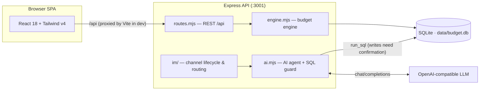

<div align="center">

# Xiaowen Budget · 小文预算

**A local-first, YNAB-style zero-based budgeting app with a built-in AI bookkeeping assistant**

[](https://github.com/iamshaynez/xiaowen-ynab/actions/workflows/ci.yml)
[](https://nodejs.org)
[](./LICENSE)

English | [简体中文](./README.md)

</div>

---

Xiaowen Budget is zero-based budgeting software that runs entirely on your own machine: your ledger, budgets, reports, and AI assistant all live inside a single SQLite file on one device. It follows the four YNAB rules — give every dollar a job, embrace your true expenses, roll with the punches, and age your money — and treats "AI that reads and writes your ledger for you" as a first-class citizen: the AI assistant works directly against your local database through a guarded SQL tool loop, and every write requires your explicit confirmation. The same assistant can also be connected to Telegram or a personal WeChat account, so you can do your bookkeeping from any chat app.

## Features

### Budgeting
- **Ready to Assign**: allocate every month's income across categories until it hits zero
- Monthly assigning, moving money between categories, covering overspending, one-click "copy last month's budget"
- Category goals: save by target date or by target balance; auto-assign fills in what each category still needs
- Age of Money, overspent categories, and uncategorized-transaction alerts

### Accounts
- Checking / savings / cash / credit cards / lines of credit / investments / property / vehicles / student & personal loans and more
- On-budget vs. tracking accounts; close accounts you no longer use
- Credit card spending automatically moves funds into the card's payment category; transfers to a card are payments

### Transactions
- Income / expense / transfer entry in one place; transfers are automatically paired double entries
- Bulk categorize, bulk delete, quick clear, reconcile
- Refunds go back to the original expense category — they reduce spending rather than counting as income

### Reports
- Net worth trend, income vs. expenses, spending breakdown, top payees, income sources

### AI Assistant
- Conversational bookkeeping and querying: "log lunch, ¥35" or "how much did we spend on dining out last month?" are answered by AI-generated SQL running directly against your local database
- Works with any OpenAI-compatible Chat Completions endpoint; base URL, model name, and API key are configurable in Settings
- Read queries run freely; **every write is blocked behind an explicit confirmation dialog**
- Persistent chat sessions; replies render Markdown and Mermaid charts

### IM Channels
- **Telegram bot**: long-polling integration — paste a bot token and go
- **Personal WeChat**: QR-code login over the ilink bot protocol; text messages only
- Multi-session management, write confirmations that survive restarts, resumable message cursors so no message is lost
- Approve or reject pending writes right from chat ("confirm" / "cancel"); `/new` starts a fresh session

### Misc
- Optional password login (JWT issued; constant-time comparison to prevent timing side channels)
- English / Simplified Chinese UI with a custom currency symbol
- One-click demo data to explore every feature

## Tech Stack

| Layer    | Technology                                                                              |
| -------- | --------------------------------------------------------------------------------------- |
| Frontend | React 18 · TypeScript (strict) · Vite 6 · Tailwind CSS v4 · Recharts · Mermaid          |
| Backend  | Node.js 20+ · Express 4 · better-sqlite3                                                |
| Data     | Single-file SQLite (WAL mode) · versioned migrations applied at startup                 |
| Testing  | Vitest (node environment for server, jsdom for React components)                        |
| CI       | GitHub Actions: typecheck + full test suite                                             |

## Architecture



The same agent session layer serves both web chat and IM channels; budget math in the engine (`goalNeed`, `ageOfMoney`, …) stays pure so it unit-tests without a database.

## Getting Started

Prerequisite: Node.js 20+.

```bash
git clone https://github.com/iamshaynez/xiaowen-ynab.git
cd xiaowen-ynab
npm install
npm run dev
```

Open <http://localhost:5173> (the API runs on `:3001`; Vite proxies `/api` automatically). On first launch, click "Load demo data" to explore the app with sample numbers.

### Production build

```bash
npm run build
npm start
```

In production mode Express serves the built frontend as well — <http://localhost:3001> is the whole app.

### Docker

```bash
APP_PASSWORD=your-password docker compose up -d --build
```

The image is a multi-stage build; data persists in the named volume `budget-data` (switch `docker-compose.yml` to a `./data:/data` bind mount if you prefer). A health check (`/api/auth/status`) is built in.

## Configuration

### Environment variables

| Variable       | Default          | Description                                                          |
| -------------- | ---------------- | -------------------------------------------------------------------- |
| `PORT`         | `3001`           | Server listening port                                                 |
| `DATA_DIR`     | `./data`         | Directory holding the SQLite database                                 |
| `APP_PASSWORD` | (unset)          | When set, enables password login for the web UI                       |
| `JWT_SECRET`   | derived from pwd | JWT signing secret; set explicitly when running multiple instances    |

### AI model

Go to **Settings → AI** in the web UI and fill in any OpenAI-compatible base URL (e.g. `https://api.openai.com/v1`), model name, and API key, then hit "test connection".

### IM channels

Add channels under **Settings → IM Channels**:

- **Telegram**: create a bot via [@BotFather](https://t.me/BotFather) and paste its token;
- **Personal WeChat**: create a channel and scan the login QR code. The protocol supports text messages only; media is not supported yet.

Enabled channels are polled by the server; config changes take effect immediately without a restart.

## Data & Security

- All data lives in a single local SQLite file (default `./data/budget.db`). There is no telemetry and no cloud dependency.
- With AI enabled, your ledger schema, account/category snapshot, and conversations are sent to whatever model endpoint you configure — choose providers you trust.
- The AI's SQL passes through multiple guard layers: single statements only, `ATTACH`/`PRAGMA`/`VACUUM` rejected, internal tables (chat history, settings, IM channels) hidden from the model, and any `INSERT`/`UPDATE`/`DELETE` requires user confirmation before it runs.
- When `APP_PASSWORD` is set, every API endpoint except login requires a valid JWT (7-day expiry).
- Back up the database file yourself — it *is* your ledger.

## Project Structure

```
.
├── src/                # React frontend (TypeScript)
│   ├── pages/          # Pages: Budget / Accounts / Reports / Transactions / Chat / Settings
│   ├── components/     # Reusable components (Sidebar, Modal, txEdit…)
│   ├── api.ts          # Typed client for /api
│   ├── store.tsx       # App-wide state
│   ├── i18n.ts         # English & Chinese strings
│   └── format.ts       # Currency / date formatting
├── server/             # Express backend (ESM .mjs)
│   ├── index.mjs       # HTTP bootstrap
│   ├── routes.mjs      # REST /api routes
│   ├── engine.mjs      # Budget computation (pure functions first)
│   ├── ai.mjs          # AI agent, SQL tool loop, and safety guards
│   ├── auth.mjs        # Password login / JWT
│   ├── migrations.mjs  # Versioned schema migrations
│   └── im/             # Telegram / personal WeChat adapters and session routing
├── data/               # SQLite database files (not committed)
└── .github/workflows/  # CI (push / PR → dev)
```

## Development

| Command                | What it does                                       |
| ---------------------- | -------------------------------------------------- |
| `npm run dev`          | Start API(:3001) and Vite(:5173) concurrently       |
| `npm run build`        | Type-check + build frontend                         |
| `npm test`             | Run the full test suite                             |
| `npm run test:watch`   | Run tests in watch mode                             |
| `npm run typecheck`    | `tsc -b --noEmit`                                   |

This project follows TDD: write the failing test first, then make it pass. New server-side logic requires a colocated `*.test.mjs`, and React components should have `*.test.tsx` coverage of their core behavior.

## Contributing

Issues and PRs are welcome:

1. Fork, then branch off `dev`;
2. Make sure `npm run typecheck` and `npm test` pass (CI must be green for PRs targeting `dev`);
3. Use conventional-ish commit messages (`feat:` / `fix:` / `chore:`).

## License

[MIT](./LICENSE) © [Xiaowen Zhang](https://github.com/iamshaynez)
